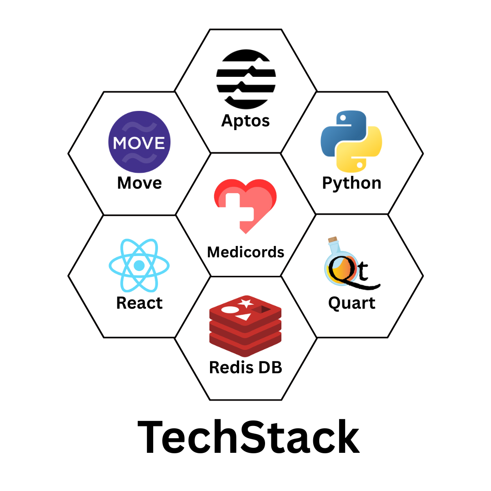

# Medicords - Your Health, Your Privacy in Your Hand Secured by Blockchain

### Introduction:
**Medicords** (aka 'Medical Records') is more than just an idea—it's a revolution. Our vision is to securely store every individual's complete medical history on the blockchain, eliminating paper-based records and preventing any dilution, destruction, or tampering by individuals or organizations.

### User Roles:
- Patients:
  - Create accounts using their Aadhar ID for unique identification.
  - Access and view their medical records securely through the portal.

- Hospitals:
  - Register using their National Identification Number (NIN).
  - Use the portal to add and manage medical records for registered patients.

### Key Features:
1. Blockchain powered Security to critical data.
2. Anytime, anywhere access with permissions.
3. Cheaper Data Storage for Hospitals and Clinics.

### Tech Stack:
- Blockchain: Aptos (Rust-based)
- Smart Contracts: Move Programmming Language
- Blockchain Interactions: Aptos-SDK for Python
- Backend / API: Quart WebFramework for Python
- Frontend: ReactJS
- Account Data: RedisDB (Key-Value)



### Getting Started:
1. Clone the GitHub Repository
   ```bash
   git clone https://github.com/jAnubhav/Medicords
   cd Medicords
   ```
   
2. Install Python Dependencies
   ```bash
   pip install -r requirements.txt
   ```
   > 📦 The requirements.txt includes:
   > - aptos-sdk
   > - quart
   > - quart-cors
   > - redis
   > - bcrypt
   > - pyjwt

3. Download and set up a blockchain wallet that supports Aptos.

4. Create a file `private_data.py` in the folder with the following data:

   ```py
   key = "Your Private Key"
   secret_key = 'Your Secret Key'
    
   host = 'Your Redis Cloud'
   port = Redis_Port_Number
   password = "Your Redis Password"
   ```
  
5. Update `controller.py`:
   - Comment Line No. 108
   - Uncomment Line No. 106
  
6. Execute the file `controller.py`. After Successful execution, undo Step No. 5 and re-execute the file.
   > A background service that pre-creates Aptos accounts and stores them for instant assignment to users, reducing onboarding time.
   
8. Execute the file `main.py`.
9. Launch the React Application
   ```bash
   cd ./frontend
   npm install
   npm start
   ```
